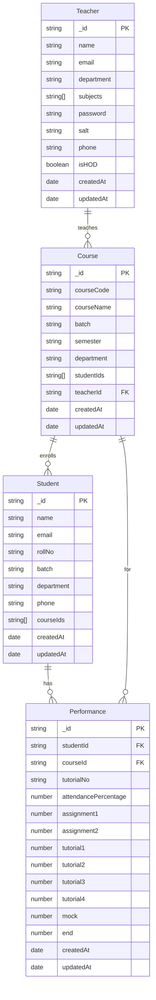

```mermaid
erDiagram
    Teacher ||--o{ Course : teaches
    Course ||--o{ Student : enrolls
    Student ||--o{ Performance : has
    Performance }o--|| Course : for

    Teacher {
        string _id PK
        string name
        string email
        string department
        string[] subjects
        string password
        string salt
        string phone
        boolean isHOD
        date createdAt
        date updatedAt
    }

    Course {
        string _id PK
        string courseCode
        string courseName
        string batch
        string semester
        string department
        string[] studentIds
        string teacherId FK
        date createdAt
        date updatedAt
    }

    Student {
        string _id PK
        string name
        string email
        string rollNo
        string batch
        string department
        string phone
        string[] courseIds
        date createdAt
        date updatedAt
    }

    Performance {
        string _id PK
        string studentId FK
        string courseId FK
        string tutorialNo
        number attendancePercentage
        number assignment1
        number assignment2
        number tutorial1
        number tutorial2
        number tutorial3
        number tutorial4
        number mock
        number end
        date createdAt
        date updatedAt
    }
```