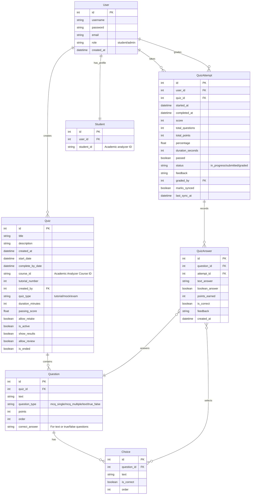

```mermaid
erDiagram
    User ||--o{ Quiz : creates
    User ||--o{ QuizAttempt : takes
    Quiz ||--o{ Question : contains
    Question ||--o{ Choice : has
    QuizAttempt ||--o{ QuizAnswer : records
    QuizAnswer }o--|| Question : answers
    QuizAnswer }o--o{ Choice : selects
    User ||--o{ QuizAttempt : grades
    User ||--|| Student : has_profile

    User {
        int id PK
        string username
        string password
        string email
        string role "student/admin"
        datetime created_at
    }

    Student {
        int id PK
        int user_id FK
        string student_id "Academic analyzer ID"
    }

    Quiz {
        int id PK
        string title
        string description
        datetime created_at
        datetime start_date
        datetime complete_by_date
        string course_id "Academic Analyzer Course ID"
        int tutorial_number
        int created_by FK
        string quiz_type "tutorial/mock/exam"
        int duration_minutes
        float passing_score
        boolean allow_retake
        boolean is_active
        boolean show_results
        boolean allow_review
        boolean is_ended
    }

    Question {
        int id PK
        int quiz_id FK
        string text
        string question_type "mcq_single/mcq_multiple/text/true_false"
        int points
        int order
        string correct_answer "For text or true/false questions"
    }

    Choice {
        int id PK
        int question_id FK
        string text
        boolean is_correct
        int order
    }

    QuizAttempt {
        int id PK
        int user_id FK
        int quiz_id FK
        datetime started_at
        datetime completed_at
        int score
        int total_questions
        int total_points
        float percentage
        int duration_seconds
        boolean passed
        string status "in_progress/submitted/graded"
        string feedback
        int graded_by FK
        boolean marks_synced
        datetime last_sync_at
    }

    QuizAnswer {
        int id PK
        int question_id FK
        int attempt_id FK
        string text_answer
        boolean boolean_answer
        int points_earned
        boolean is_correct
        string feedback
        datetime created_at
    }
```